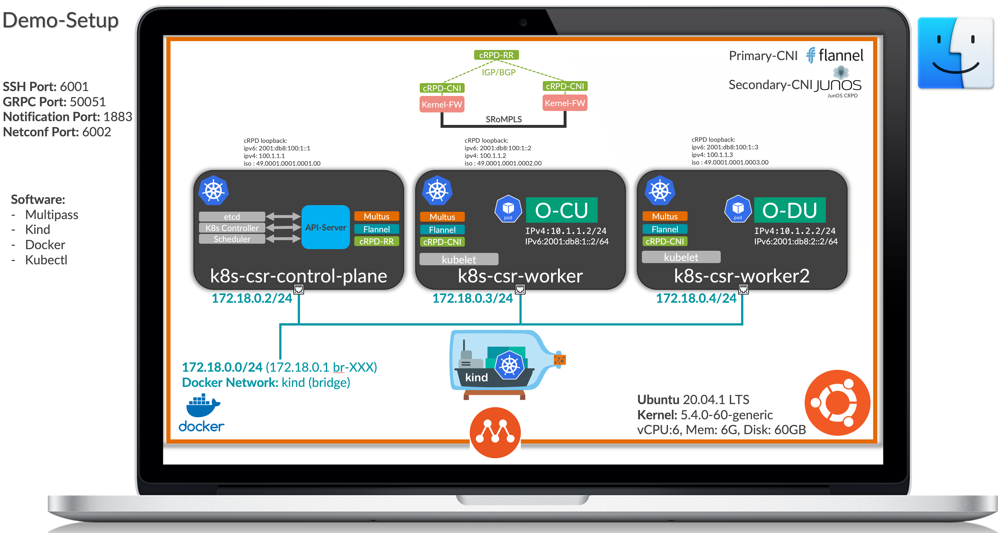

# How to setup cRPD (JunOS) CNI with KIND in your Mac? 

The first step is you need '[multipass](https://multipass.run/)' SW in your MAC. There is an issue with docker 'linuxkit', missing 'IP_Tunnel' kernel module, so MPLS router functionality is not working.  Let's use 'MultiPass' Mini cloud SW and create a Ubuntu VM for our setup.  

Donwload [MultiPass](https://multipass.run/download/macos) and Install in your Mac.

### Setup Diagram ###



Please use the following command to create Ubuntu VM and adjust resources if needed per your Mac available resources. I use the following and running setup for more than a week without any issues.

```bash
multipass launch -n k8s-csr --cpus 6 --mem 6G --disk 60G

# Check Status of VM
multipass list
```

Open Ubuntu VM Shell and install following softwares:

```bash
multipass shell k8s-csr
```

* [Docker Installation](https://docs.docker.com/engine/install/ubuntu/)
* [Kind Intallation](https://kind.sigs.k8s.io/docs/user/quick-start/#installation)
* [Kubectl Installation](https://kubernetes.io/docs/tasks/tools/install-kubectl/#install-using-other-package-management)


Install Linux generic module for cRPD Kernel Forwarding Plane

```bash
# On multipas host install following for MPLS and IP kernel modules
apt update
apt-get install linux-modules-extra-$(uname -a | awk '{print $3}')
lsmod | grep mpls
modprobe mpls_router
modprobe mpls_iptunnel
lsmod | grep mpls
```

```bash
# Git Clone the Repo
cd /root
git clone https://github.com/qarham/q-k8s.git

# Create KIND Cluster
cd mac-kind
kind create cluster --name q-k8s-csr --config 3_nodes_cluster_flannel.yaml

# Check cluster status
kubectl cluster-info --context kind-q-k8s-csr
kubectl get pods -A -o wide
kubectl get nodes -o wide
```

## Installation of Flannel and Multus

The next step is instllation of Primary CNI 'Flannel' and multi-cni support 'Multus'.

```bash
kubectl apply -f kube-flannel.yml

# Make sure all PODs are up & running
kubectl get pods -A -o wide
```

Note: cRPD CNI is used as seconday CNI in this scenario so Multus installation is required. Please use following command to install Multus CNI

```bash
kubectl apply -f multus-daemonset.yml

# Check Multus CNI is UP and Running
kubectl get pods -A

```


## Install cRPD Images 

Next step is download cRPD Secondarty CNI images and load into Ubuntu Docker. Please use following link to download the images:

[cRPD_CNI_Images](https://junipernetworks-my.sharepoint.com/:u:/g/personal/qarham_juniper_net/EcJB_6sBL-xJiPI_715jsLUBsxLeDlodjdVBjjpA8MWgSA?e=fjemvs)

Next step is copy the cni image file 'crpd_cni_images.tar.gz' under '/var/tmp' and Load images into Docker running in MultiPass Ubuntu VM.

```bash
# Use multipass command to donwload the images to Ubuntu VM name 'k8s-csr'
multipass transfer /Users/qarham/Downloads/crpd_cni_images.tar.gz k8s-csr:/var/tmp

#Login to Ubuntu VM
cd /var/tmp
tar xvf crpd_cni_images.tar.gz

# Load Images
docker load < crpd_latest.tar.gz
docker load < crpd_secondary_cni_latest.tar.gz
docker load < crpd_crd_new_latest.tar.gz
docker load < crpd_crd_helper_latest.tar.gz
```

As KIND Cluser is using ContainerD RunTime so you have to load all images into KIND Clsuter nodes using following commands.

```bash
# Copy cRPD JunOS image and cRPD Secondary CNI image to KIND Cluster
kind load docker-image crpd_secondary_cni:latest --name q-k8s-csr
kind load docker-image crpd:latest --name q-k8s-csr
# Copy CRD Images  to KIND Cluster
kind load docker-image crpd_crd_helper:latest --name q-k8s-csr
kind load docker-image crpd_crd_new:latest --name q-k8s-csr

# Check images loaded in KIND Cluster
docker exec -it q-k8s-csr-control-plane crictl images
docker exec -it q-k8s-csr-worker crictl images
docker exec -it q-k8s-csr-worker2 crictl images
```

## cRPD Kernel MPLS Config

Login to k8s-woker nodes and set 'platform_labels' and interface 'input' config

```bash
docker ps

docker exec -it q-k8s-csr-worker bash -c "echo 1048575 > /proc/sys/net/mpls/platform_labels"
docker exec -it q-k8s-csr-worker2 bash -c "echo 1048575 > /proc/sys/net/mpls/platform_labels"
docker exec -it q-k8s-csr-worker bash -c "echo 1 > /proc/sys/net/mpls/conf/eth0/input"
docker exec -it q-k8s-csr-worker2 bash -c "echo 1 > /proc/sys/net/mpls/conf/eth0/input"

#Verify Changes
docker exec -it q-k8s-csr-worker bash -c "cat  /proc/sys/net/mpls/platform_labels"
docker exec -it q-k8s-csr-worker2 bash -c "cat /proc/sys/net/mpls/platform_labels"
docker exec -it q-k8s-csr-worker bash -c "cat /proc/sys/net/mpls/conf/eth0/input"
docker exec -it q-k8s-csr-worker2 bash -c "cat /proc/sys/net/mpls/conf/eth0/input"

```

## Deploy cRPD Seconday CNI

Before cRPD CNI is deplyed get your cRPD License from 'Internal Licensing Portl and create a secret in K8s using the following command.

```bash
kubectl create secret generic crpd-license -n kube-system --from-literal=CRPDLICENSE="<cRPD_License>"

# Edit cRPD secret and get 'CRPDLICENSE' Data
kubectl get secret -A | grep crpd
kubectl edit secret crpd-license -n kube-system
# Copy the CRPDLICENSE Data 
```

Please update 'crpd_cni_seconday.yml' last section with ' CPRDLICENSE' Data copied in previouse step.

```bash
cd workload-test-1
vi crpd_cni_secondary.yml   # Updated the CRPDLICENSE with the Token Key copied earlier and Save the file

# Create cRPD CNI using following commad
kubectl apply -f crpd_cni_secondary.yml

# Check all crpd Daemonsets are up and running
kubectl get pods -A
kubectl get ds -A
```

## Workload Testing (Scenario # 1)

In this scenario, we will use two PODs 'O-CU' running on 'site=edc' and 'O-DU' running on 'site=cell' with dual Stack and test IPv4/IPv6 connectivity using SRoMPLS.

The first step is label our 'k8s-wokrer' nodes.

```bash
kubectl get nodes --show-labels
kubectl label nodes q-k8s-csr-worker site=edc
kubectl label nodes q-k8s-csr-worker2 site=cell
```

```bash
kubectl apply -f empty_net_def.yml

# Create O-CU POD on EDC site
kubectl apply -f O_CU_pod_edc_site.yml
kubectl get pods

# Create O-DU POD on Cell site 
kubectl apply -f O_DU_pod_cell_site.yml
kubectl get pods
```

Test Traffic between O-CU and O-DU:

```bash
kubectl exec -it cu-node-1 -- ping -c2 10.1.2.1
kubectl exec -it cu-node-1 -- ping -c2 10.1.2.2

kubectl exec -it cu-node-1 -- ping -c2 2001:db8:2::1
kubectl exec -it cu-node-1 -- ping -c2 2001:db8:2::2

# TCPDUMP during PING Test
docker exec -it q-k8s-csr-worker tcpdump -nei eth0 mpls
```

## JunOS cRPD CRD deployment for Configuration changes


```bash
cd ../crpd_crd/

# Create JunOS cRPD Operator Service Account
kubectl apply -f crpd_operator_service_account.yml
# Create cRPD operator PODs 
kubectl apply -f crpd_crd_new.yml 
kubectl apply -f crpd_operator_deploy.yml

# Check status of the PODs
kubectl get pods -A
```

Test cRPD CRD Operator (POC):

```bash
# Using following manifest enable BGP trace log on Worker nodes
kubectl apply -f crpd_junos_bgp-trace__config.yml
# Check Status of the POD
kubectl get pods -A

# Login to Worker cRPD and check Configuration Changes are there
ssh root@172.18.0.3 -p 6001

# JunOS Command to Check 'Protocol BGP' config changes
show configuration protocols bgp
```

## Other Tips

* How to SSH to cRPD CNI using SSH?

You can SSH to each cRPD POD using Port '6001'.

```bash
root@k8s-csr:~/q-k8s/mac-kind/workload-test-1# kubectl get nodes -o wide
NAME                      STATUS   ROLES    AGE    VERSION                          INTERNAL-IP   EXTERNAL-IP   OS-IMAGE       KERNEL-VERSION     CONTAINER-RUNTIME
q-k8s-csr-control-plane   Ready    master   126m   v1.19.7-rc.0.21+85c99cf988c967   172.18.0.2    <none>        Ubuntu 20.10   5.4.0-62-generic   containerd://1.4.0-106-gce4439a8
q-k8s-csr-worker          Ready    <none>   126m   v1.19.7-rc.0.21+85c99cf988c967   172.18.0.4    <none>        Ubuntu 20.10   5.4.0-62-generic   containerd://1.4.0-106-gce4439a8
q-k8s-csr-worker2         Ready    <none>   126m   v1.19.7-rc.0.21+85c99cf988c967   172.18.0.3    <none>        Ubuntu 20.10   5.4.0-62-generic   containerd://1.4.0-106-gce4439a8
root@k8s-csr:~/q-k8s/mac-kind/workload-test-1#

# To SSH use following commands:
ssh root@172.18.0.2 -p 6001
ssh root@172.18.0.3 -p 6001
ssh root@172.18.0.4 -p 6001
```

* How to check VRF is created on Worker nodes?

```bash
docker exec -it test-worker ip link | grep -B2 VRF
```


In case you have to build CNI binary please use following steps:

```bash
cd /root/q-k8s/mac-kind
git clone https://github.com/containernetworking/plugins.git
cd plugins
# this will build the CNI binaries in bin/*
./build_linux.sh
```

* [Go Installation](https://tecadmin.net/install-go-on-ubuntu/)

```bash
sudo snap install go --classic
```